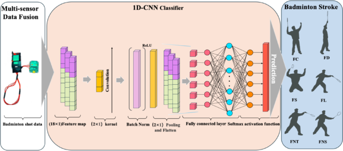
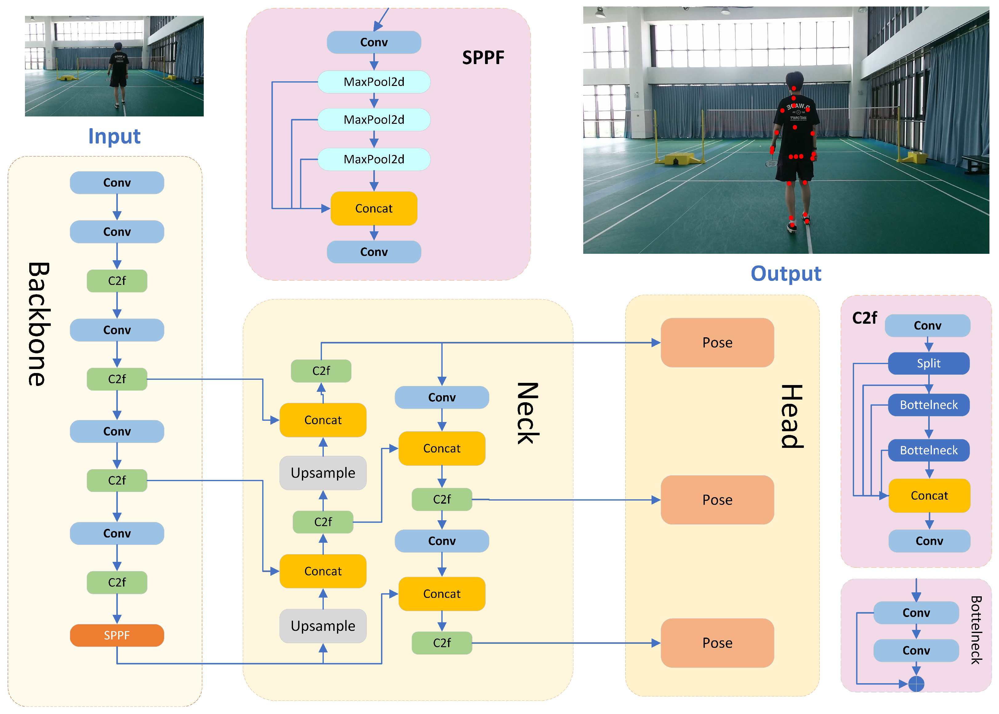
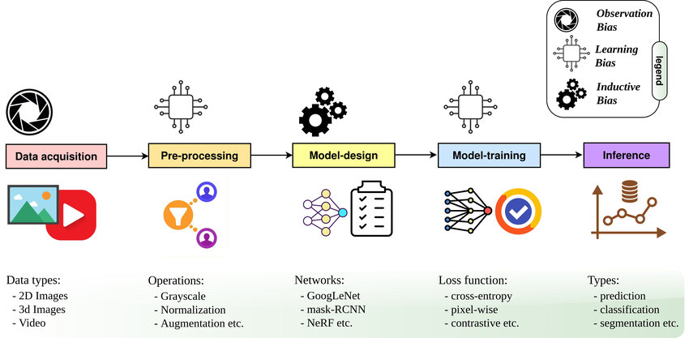
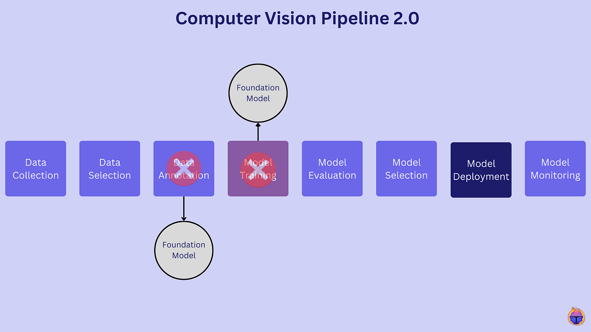

# Badminton-AI-coach
This report evaluates the feasibility of using spatial logic and computer vision for analysing athletes, spheres, and movements in sports videos.
下面给你生成一份专业级 README（英文版），适合放到 GitHub，用于向老师 / 技术评审展示你的 Badminton AI Coach 项目的开发流程、技术架构、核心模块、数据流和未来规划。✨
（内容会结合你之前写的可行性报告 + 你的新 idea，如视场角/3D 建模/落点变换等）

⸻

🏸 Badminton AI Coach

A Mobile Computer Vision System for Automated Badminton Skill Analysis

📌 Overview

Badminton AI Coach is a mobile-based intelligent training assistant that uses computer vision, pose estimation, and action recognition to provide real-time or post-training feedback for badminton players. Users simply record videos with their smartphones, and the system automatically produces:
	•	Stroke type recognition
	•	Landing point detection
	•	Trajectory & heatmap analytics
	•	Footwork and reaction metrics
	•	Training quality scoring
	•	Personalized correction suggestions

This project aims to democratize professional-level coaching by combining lightweight CV models, 3D court modeling, and on-device inference.

⸻

🧩 System Architecture

1. Client (Mobile App)
	•	Video capture (single-camera)
	•	Local inference (model quantized → CoreML / TFLite)
	•	On-device preprocessing (resize → normalize → frame sampling)
	•	UI for training feedback (score, heatmap, technique tips)

2. Backend (Optional Cloud Mode)
	•	Heavy models (object tracking, action recognition transformer)
	•	User profile & training history
	•	Heatmap generation & performance trends

3. Core CV Components

🔹 (1) Player & Racket Detection
	•	Model: YOLOv8 / YOLO-NAS
	•	Lightweight, high FPS on mobile
	•	Detects: player, racket, shuttlecock (optional proxy via motion)

🔹 (2) Tracking
	•	Model: ByteTrack / OC-SORT
	•	Tracks:
	•	Shuttlecock flight path
	•	Player footwork
	•	Racket movement velocity

🔹 (3) Pose Estimation
	•	Model: RTMpose / MoveNet
	•	Keypoints:
	•	Wrist, elbow, shoulder
	•	Hip, knee, ankle
	•	Purpose:
	•	Technique analysis
	•	Swing angle detection
	•	Weight transfer analysis

🔹 (4) Action Recognition
	•	Model: SlowFast / TimeSformer / TSM
	•	Classes:
	•	Drop
	•	Clear
	•	Smash
	•	Net shot
	•	Lift
	•	Drive
	•	Serve

🔹 (5) Court Localization & 3D Modeling (你的独家思路)

解决手机视场角不同导致“落点判断不准”的核心技术。

流程：
	1.	通过 Hough Line 或 CourtKeypointNet 检测羽毛球场线
	2.	自动反求摄像头内参（single-view camera calibration）
	3.	构建 标准羽毛球场 3D 模型
	4.	生成摄像头在 3D 空间中的“自由视角位置”
	5.	将图像中的梯形映射 → 正射、复原真实空间坐标
	6.	Shuttlecock 落点 → 精准落点推算与热力图展示

🔹 (6) Training Scoring System

基于：
	•	技术动作稳定性
	•	击球质量（角度、速度）
	•	落点合理性
	•	步伐移动效率
	•	反应速度

⸻

🔄 Development Workflow

Phase 1 — Research & Dataset Preparation
	•	Collect datasets:
	•	VideoBadminton Dataset (Auburn University)
	•	BadmintonNet Dataset (NCU)
	•	Custom recorded training videos
	•	Data labeling:
	•	Key strokes
	•	Footwork categories
	•	Shuttlecock flight endpoints

Phase 2 — Baseline Modelling
	•	YOLO baseline for racket/player detection
	•	Initial Shuttlecock tracker
	•	Basic heatmap generation
	•	First version of action classification (TSM)

Phase 3 — 3D Court Modeling & Calibration (你的核心亮点)
	•	Implement single-camera calibration
	•	Detect court lines automatically
	•	Map 2D → 3D via homography + camera pose estimation
	•	Generate accurate landing point conversion

Phase 4 — Integrated CV Pipeline
	•	Combine detection → tracking → pose → action recognition
	•	Standardize frame IO and inference pipeline
	•	Optimize ML model to run on mobile device

Phase 5 — Mobile App Development

Frontend (React Native / Flutter):
	•	Video recording mode
	•	Training summary page
	•	Stroke classifier page
	•	Heatmap overlay
	•	Progress dashboard

Phase 6 — Optimization for Deployment
	•	Quantization (INT8)
	•	TFLite / CoreML conversion
	•	FPS profiling
	•	Model pruning
	•	On-device caching of feature vectors

⸻

🗂 Repository Structure

badminton-ai/
│── app/               # Mobile app frontend
│── backend/           # Model APIs, user management
│── models/
│   ├── detection/
│   ├── tracking/
│   ├── pose/
│   ├── action/
│── court-model/
│   ├── calibration/
│   ├── homography/
│   ├── 3d-reconstruction/
│── datasets/
│── notebooks/         # Research & experiments
│── scripts/           # Preprocess / training scripts
│── docs/              # Architecture diagrams
│── README.md

⸻

🚀 Key Innovations in This Project
	1.	3D badminton court modeling for single-camera calibration
→ Solves the industry pain point: mobile phone FOV uncertainty.
	2.	Multi-chain CV pipeline on lightweight models
→ Real-time inference on mobile (not just server-based).
	3.	Trajectory-aware landing point estimation + heatmaps
→ Comparable to professional badminton analysis systems.
	4.	Action recognition tailored for amateur players
→ Robust to noisy input, non-professional environment.
	5.	On-device training scoring
→ No privacy leakage & fast feedback.

⸻

🗺 Future Work
	•	Multi-view fusion
	•	Racket sweet-spot & power estimation
	•	Self-coaching LLM for personalized improvement plan
	•	Multiplayer rally analysis
	•	Compatible with VR/AR training environments
